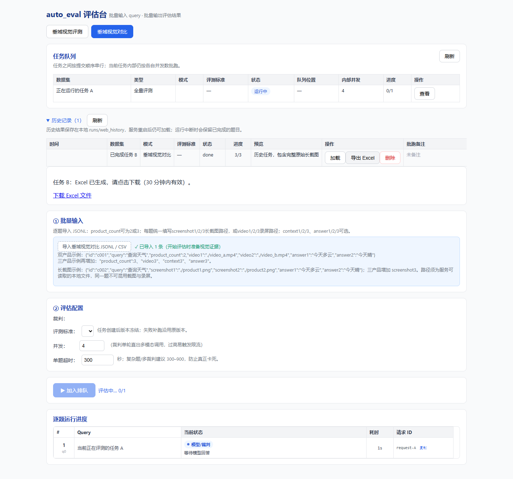

# 运行任务期间加载历史与导出 Excel：修复记录

日期：2026-09-10；分支：`feat/long-screenshot-evaluation`。

## 问题与定位

用户报告有任务运行时，加载其他任务后无法导出 Excel。隔离测试表明，没有“运行时禁止导出”的业务限制；模型请求异步等待期间，另一历史任务可正常导出。检查与模拟复现定位到以下问题：

- 历史任务未加载完成时，导出仍使用旧任务 ID；连续加载时，旧请求晚返回会覆盖最后选择的任务。
- 图片编码在异步评测方法内同步执行；任务快照也在事件循环内序列化和写盘，可能延迟历史加载、状态查询及下载响应。
- XLSX 使用 `BytesIO` 保存完整文件。嵌入完整原图后，导出内存会与运行中的评测争用。
- 页面直接 `window.open()` 下载，没有生成状态和失败反馈，无法区分生成中、弹窗拦截或请求错误。

尚未取得线上当次失败的请求/服务日志，因此不能将上述某一个问题认定为该次故障的唯一原因。

## 用户可见变化

1. 历史列表新增“导出 Excel”，按该行任务 ID 导出，无需切换当前查看的任务。
2. 页面显示排队、生成中、完成或错误信息。完成后点击“下载 Excel 文件”，使用浏览器文件下载，不通过弹窗或浏览器 Blob 承载完整大文件。
3. 加载历史期间，当前任务的导出按钮暂时禁用；请求取消与版本校验防止旧响应覆盖新选择。任务提交、补跑响应和错误恢复也检查当前视图归属。
4. 保留完整原始长截图、原评分列和历史任务格式；模型长截图仍按既有原字节/切片规则发送。



## 后端实现与兼容性

- `exports.py`：独立后台导出，不进入评测 FIFO 队列。最多接受 4 个未完成导出，同一任务正在生成时复用导出 ID；每次只执行一个后台生成任务。工作簿生成器还通过进程内信号量统一限制新旧入口的生成并发。
- `history.py`：新增 `write_xlsx(snapshot, destination)`，直接写临时文件。保留 `build_xlsx()` 字节返回接口供既有调用方使用，复用同一份 OOXML 生成逻辑。
- `server.py`：保留 `GET /api/eval/{task_id}/export?format=xlsx`，改为文件响应并在传输完成后清理临时文件。新页面使用下表的后台接口。
- `persistence.py`：在事件循环内冻结快照；后台按顺序写入；每个任务只保留一个待写版本，并合并其等待对象。初始任务、评测进度、补跑、备注与队列状态共用写入通道，避免不同保存路径交错覆盖。
- `runner.py`、`scheduler.py`、`tasks.py`：终态与正常关闭等待落盘；保存期间防止任务被提前退休、淘汰或删除。异常退出仍可能丢失尚未写完的后台/节流窗口内状态；历史快照结构不变。
- 两个视觉裁判：图片读取、校验和编码整体移到线程，保留产品顺序、图片字节、哈希校验和原有编码参数；模型请求仍使用异步客户端。

| 接口 | 行为 |
| --- | --- |
| `POST /api/eval/{task_id}/exports` | 返回 202 和 `export_id`、`task_id`、`status`；队列已满返回 429。 |
| `GET /api/exports/{export_id}` | 查询 `queued/generating/ready/error`，失败时附带可展示的错误说明。 |
| `GET /api/exports/{export_id}/download` | 就绪时返回文件；未就绪返回 409；过期返回 404。 |

生成快照在实际开始生成时固定。导出记录与链接按完成时间保留 30 分钟，并限制保留的完成记录数量；后续请求触发过期清理。正常关闭清理导出文件；重启遗留且过期的、符合本模块命名规则的文件也会在清理时回收。服务重启后需重新发起导出，原始评测任务不受影响。

## 验证结果

- 自动化覆盖双/三产品、长截图/录屏、旧下载入口、原图 SHA256、任务切换竞态、导出状态和失败重试。
- 阻塞模拟编码或导出线程时，其他 API 仍能响应；快照测试覆盖冻结、有序、待写版本合并、失败恢复、取消评测时等待终态落盘，以及保存期间禁止删除。
- Chrome 验证：页面仍查看运行中的任务 A，从历史列表发起任务 B 的导出，显示生成状态、下载成功，实际下载文件与服务端文件 SHA256 一致。
- 同一份约 18.02 MB、含 6 张原图的工作簿：`tracemalloc` 测得完整内存生成峰值约 24.66 MB，文件式生成约 3.23 MB，约减少 87%。6 张图片均与原文件字节一致。该指标仅统计 Python 分配，不是进程 RSS 或线上容量承诺。

测试命令（仓库根目录，PowerShell）：

```powershell
$env:PYTHONPATH='C:\workspace\auto_eval_agent\src'
& C:\workspace\venv\Scripts\python.exe -m pytest -q -p no:cacheprovider tests/test_background_export.py
& C:\workspace\venv\Scripts\python.exe -m pytest -q -rs -p no:cacheprovider
node tests/test_history_export_ui.cjs
```

专项 14 项通过；最终全量测试 **159 passed, 2 skipped**，耗时约 18 秒。两项媒体测试因本机缺少 `ffmpeg/ffprobe` 跳过，另有 4 条已有的 FastAPI `on_event` 弃用警告。浏览器及并发验证使用模拟数据和模型，不调用线上百炼 API。

## 部署

同步本次 `src/auto_eval` 下的修改及新增模块，后端和前端一起更新，重启服务后刷新页面。无需安装新生产依赖、修改私有配置或迁移历史任务。端口仍为 8054，沿用项目现有单进程任务状态管理方式。需确保 `runs/exports` 有足够磁盘空间容纳完整原图工作簿。
