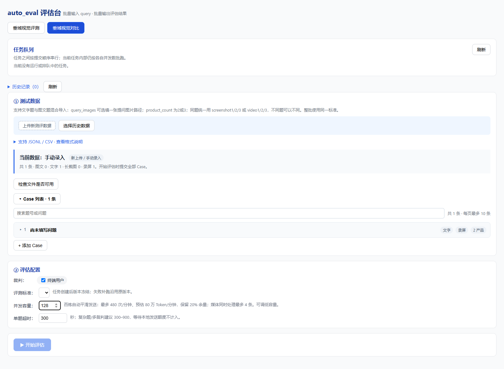

# 百炼单任务请求吞吐优化

分支：`feat/bailian-request-throughput`，基于 `50a4de0`。核实日期：2026-09-11。

## 官方口径与本地目标

模型使用正式 ID `qwen3.5-397b-a17b`。百炼官方默认额度为 600 RPM、1,000,000 TPM（输入与输出之和），所列北京、美国、新加坡、德国地域一致。配额按主账号、模型统计，同账号多个 Key 共享；还可能执行秒级 RPS/TPS 和动态突发增速限制。这不等于“最多十个请求同时等待响应”。

来源：[官方限流表](https://help.aliyun.com/zh/model-studio/rate-limit)、[限流应对最佳实践](https://help.aliyun.com/zh/model-studio/rate-limiting-best-practices)。具体账号、业务空间若有更低限制，以其实际额度为准。

本次采用官方默认额度的 80%，不尝试跑到极限：

| 控制项 | 默认值 | 意义 |
| --- | --- | --- |
| 请求速率目标 | 480 RPM | 稳态至多平均 8 次/秒，逐个平滑发出 |
| Token 预算目标 | 800,000 TPM | 请求前预估预留，响应 usage 结算 |
| Case 容量 | 128，可手动降低 | 允许更多请求同时等待结果 |
| API 在途上限 | 128，共享 | 独立于发送速率的资源保护 |
| 媒体预处理并发 | 4 | 视频抽帧、长截图处理、图片编码分别受此上限控制 |
| 冷启动 | 15 秒升速 | 从目标速率的 25% 逐步增长，空闲超过 30 秒重新预热 |
| 突发服务端排队 | 30 秒 | `X-DashScope-Wait-Timeout`，只帮助突发限流 |

128 是本地工程容量选择，不是官方并发额度，也不是一次发出 128 次请求。大型原图/长截图仍可能使在内存中的请求内容较大，资源较小的服务器可在页面调低到 16/32/64；减少容量会影响长耗时请求的吞吐。没有降低图片质量、抽帧数量或裁判输出要求。

## 调度流程

1. 顶层任务仍由原 FIFO 队列串行执行。`scheduler.py` 无改动，多轮会话内部依赖顺序也保留。
2. 一个任务内允许多个 Case 滚动执行，完成任意一条即可补进下一条。媒体准备另用四个槽位，其排队时间不占媒体处理超时。
3. 真正发送 HTTP 请求之前，共享控制器检查在途上限、过去 60 秒请求数和预估 Token 预算，再按请求/Token 两者中更严格的间隔发出。等待额度不需要上一批全部返回。
4. 所有流式重试、`stream_options` 兼容重试和 JSON 修复共用这个入口，均重新占用请求额度。SDK 原有自动重试仍关闭。
5. 429/503 或限流信号引起共享冷却和速率减半；同一波在途错误不会连续把速率减半。遵守 `Retry-After`，默认至少冷却 5 秒。成功后每至少 10 秒恢复目标速率的 10%，最高恢复到本地 80% 目标。
6. 取消等待不会遗留未来发送预约；失败、取消、超时释放在途槽位，已发送请求的预留不会随失败退款。

发送控制器保存在事件循环上：同进程同循环的不同客户端、Key、补跑和连续任务共享预算。为保守起见，所识别模型的不同账号/地域也共享同一个本地预算。它不能统计其他程序、其他进程或服务器对同账号的用量；20% 余量不是跨程序配额锁。此版本不更改服务启动方式，不新增多进程/Redis 调度依赖。

## Token 估算与超时

文本初始按 UTF-8 字节数保守估算；图片按实际编码图片尺寸的 32 像素网格及每图封装余量估算，不把 Base64 字符串当作文本 Token，也不为估算重新获取远程图片。无法读取尺寸的远程图片使用保守固定预留。

输出冷启动预留 8192 Token。收到真实 usage 后校正当前预算；文本/视觉输入分别校准估算比例，保留 20% 估算余量，输出预留对较长响应快速增大、对较短响应逐渐降低。长于一分钟的响应完成后仍计入近期输出，避免遗忘跨窗口输出成本。缺少 usage 的调用保留预估扣款。

这些是本地流控估算，不是百炼的精确计费 tokenizer。内容变化、思考输出和服务端实际限流窗口都可能引起偏差；TPM/TPS 仍可能触发 429，因此需要反馈降速。单个大请求也不能通过匀速发送消除自身 Token 突发。

单题超时继续约束实际评测执行，包括模型调用及本地重试退避；明确的本地额度等待、在途槽位等待和媒体槽位等待不计入这个执行预算。单次 HTTP/流式调用的总超时从取得额度后开始，服务端排队仍计入 HTTP 超时。排队期间可取消，取消会清理子任务。

## 启用与部署

- 当正式模型 ID 与百炼官方 DashScope/MAAS 域名匹配时自动启用。不会把本地 YAML 中其他服务商的同系列模型误认为百炼，也不改 URL、Key 或模型名称。
- `/api/config` 返回是否启用及推荐容量，页面初始采用 128；用户手动调低后切换评测模式仍保留该值。非目标服务商默认保持 4，没有新增百炼请求头或限流器。
- 新任务未指定并发容量时后端补入推荐值；显式指定的值保留。旧历史任务已有的并发参数保留，补跑不会偷偷把原先的 10 改为 128；重新创建任务可采用新推荐值。
- 现有 YAML、环境变量、队列逻辑、统计表和评分协议均未改动。自建代理或模型别名不会自动识别为该官方组合。
- 在现有任务结束后重启后端、刷新页面生效。本次没有重启用户服务、提交真实模型请求或推送远端。

## 验证

新增 `tests/test_request_throttle.py` 覆盖：前序响应未返回时继续发送、RPM/TPM 窗口、usage 校准、冷启动与空闲恢复、共享 429 冷却、跨窗口输出、取消释放、媒体独立限流、所有 HTTP 尝试重新准入、执行超时与排队分离、真实 runner 的大于十条并发及手动容量。

生产控制器的虚拟时钟模拟：240 条 Case，每次响应延迟固定 30 秒，每次输入输出总计 10,000 Token，预估与真实总量一致，无媒体耗时和服务端错误。原并发 10 需要 720 秒，新调度约 215.47 秒，约 3.34 倍；最高 40 个请求在途，任意模拟 60 秒最多 80 个请求。此模拟只验证调度收益，不能作为真实百炼性能承诺。

前端截图使用本地页面、模拟百炼配置和空历史数据生成，没有提交评测。

最终验证结果：291 项 Python 测试通过；5 个 Node 前端脚本通过；真实 Edge 浏览器确认初始容量 128、手动值在切换模式后保留、页面无脚本错误。全量回归使用指定的 `C:\workspace\venv\Scripts\python.exe` 和仓库 `src` 作为 `PYTHONPATH`。本地 ffmpeg 在普通沙箱中有启动权限限制，最终改用独立临时目录、允许启动本地子进程的环境完成全量验证。没有调用真实模型。

