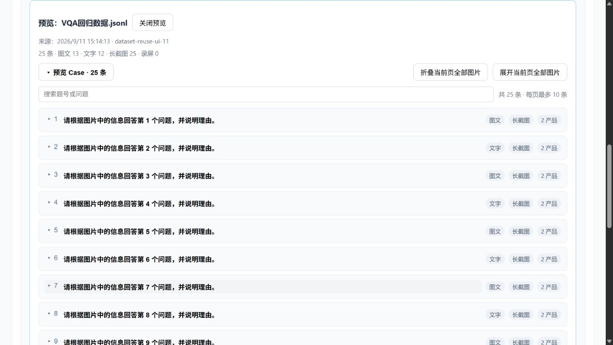

# 垂域视觉对比：历史数据复用

本次功能仅调整“垂域视觉对比”的测试数据输入区域。

## 使用流程

1. 点击“上传新测评数据”导入 JSONL / CSV，或点击“选择历史数据”。两个入口一直保留在输入区顶部。
2. 历史数据展示文件名、备注、Case 数量和任务时间，支持按文件名、备注、任务编号搜索，每页最多 10 份。同名文件的不同评测任务分别保留。
3. 点击“预览 Case”查看该任务提交的数据。预览为只读，不替换当前输入，也不启动评测。
4. 点击“使用这份数据，新建评测”，将完整数据载入输入区，自动检查关联文件路径。可修改问题、背景、产品回答、证据路径和提问图片，再使用当前所选测评标准发起新任务。原任务及结果不变。
5. 上传或复用的数据使用同一套 Case 列表：默认折叠，每页最多 10 条，可搜索题号/问题、查看完整文本。分页和搜索只影响展示，开始评估会提交全部 Case；有不完整条目时提示修正，不会静默跳过。

## 图片、长截图和录屏

- 展开 Case 只展示文本；点击对应图片/录屏按钮才请求媒体。长截图可以在预览区域滚动，提供查看原图和下载原图。
- “展开当前页全部图片 / 折叠当前页全部图片”只针对当前页，录屏需单独点击。换页、修改路径、关闭预览会清理媒体显示及未完成请求。
- 下载返回原始文件字节，不把页面缩略图作为原图导出。录屏格式若无法在浏览器播放，仍保留下载入口。
- 预览接口沿用提问图片的授权目录以及回答证据的项目目录 / `OPERATION_VIDEO_ROOTS`。不会为了预览放开任意文件读取。
- 临时预览地址使用随机标识，保存在进程内，最多 512 个，有效期 30 分钟；服务重启后失效，重新点击即可生成。文件修改后旧预览拒绝读取。
- 路径检查检查文件存在性和目录授权；图片内容合法性在点击预览时检查，模型可用性仍以正式评测为准。

## 数据与兼容性

历史复用读取任务快照中保存的已解析输入，并非重新读取上传的源 JSONL/CSV 原文件。保留文件名、源字段、行号及图片元信息；新任务通过 `options.dataset_source_task_id` 记录来源。原文件中未成功导入的行无法从历史快照恢复。

只有已经提交并保存任务快照的数据会出现在历史列表；仅上传但尚未提交的数据不会新增历史记录。历史任务被删除后不再可选；外部录屏或长截图文件被移走后会提示缺失。复用后的未提交修改在被新数据替换前会要求确认。

新增接口：`GET /api/datasets`、`GET /api/datasets/{task_id}`、`POST /api/dataset-files/validate`、`POST /api/dataset-media`、`GET /api/dataset-media/{token}`。旧历史与导出接口保持兼容。

无需修改配置文件或迁移历史数据。部署包含后端改动，需要重启 Web 服务并刷新页面；请在当前评测任务结束后重启。

## 验证

- Python 全量回归：238 passed，2 skipped。
- 前端 Node 回归覆盖上传、复用隔离、25 条跨页完整提交、未提交修改保护、图片按需加载、旧请求返回后的状态保护以及原有导出/重试流程。
- 浏览器实际验证：12 份历史数据分页、25 条用例预览与载入、真实提问图片及长截图、保留上传入口和文件检查。使用合成数据，无模型调用。

