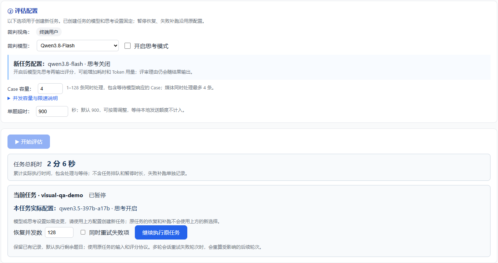

# 裁判模型与思考模式

评估配置可以选择一个裁判模型，并独立开启或关闭百炼原生思考。支持两个评测模式：垂域视觉评测、垂域视觉对比。裁判视角仍为终端用户；评测标准独立选择。

## 现有百炼部署升级

1. 更新代码并重启服务，保留服务器现有 `config/judges.yaml` 和 `.env`。
2. 如果当前使用百炼兼容接口，且模型为 `qwen3.5-397b-a17b` 或 `qwen3.8-flash`，平台自动提供两个选项。默认模型沿用现有配置；思考默认沿用显式 `enable_thinking`，未设置时使用这两个模型的百炼默认值 `true`，并明确保存到新任务。
3. 首次切换后，用同一小批截图/录屏样本检查四种组合的评分、JSON 解析成功率、耗时和 Token 用量。自动化测试使用模拟响应，不能代替账号调用权限和实际效果验证。

仓库原有 SiliconFlow 配置不自动改成百炼；这类部署继续显示原模型。完整百炼配置见 [judges.bailian.example.yaml](../config/judges.bailian.example.yaml)，可将配置合并到 `config/judges.yaml`。不要覆盖服务器已有地域地址、密钥变量名和其他部署设置。

`judge_model_profiles` 由管理员配置；浏览器只提交配置 ID 和布尔开关，不提交网关或密钥。示例：

```json
{
  "mode": "rich_content",
  "items": [{"id": "example", "query": "示例"}],
  "options": {
    "judge_model_profile": "bailian_qwen38_flash",
    "enable_thinking": false
  }
}
```

以上仅展示选项格式，实际题目仍须携带对应模式所需的答案和视觉证据。未知配置 ID、字符串 `"false"`、不支持思考的模型收到开关、一次选择多个裁判，均返回 422。

## 任务配置与历史

新任务创建时生成独立 `judge_runtime` 快照，保存模型、思考值、采样与连接参数以及密钥环境变量引用，绝不保存密钥值。运行时读取快照，配置文件后续变化不会让同一任务中途切换裁判。密钥仍在执行时从指定环境变量读取，因此可以轮换密钥。限流预算属于运行配置：恢复、补跑及再次执行时，对同模型、同裁判且连接地址和密钥引用一致的当前配置，仅刷新 `rate_limit`；原始快照与推理参数保持不变。这样旧任务不会把升级后的共享调度器重新压回旧预算。

暂停恢复、失败补跑、增量追加/更新题目都沿用原任务配置。向这些接口提交不同模型或思考值会被拒绝；更换设置应复用数据集创建新任务。页面将原任务的实际配置与新任务表单分开展示，CSV/Excel 与历史记录显示模型和思考开关。

旧记录没有思考值时显示“未记录”，恢复时保持省略原生思考参数，不继承当前配置的新开关。旧任务只有在协议快照或结果中能确认唯一裁判模型时才可继续；无法确认模型或记录混用多个模型时返回 422，需复用数据集创建新任务。可恢复的旧任务使用原裁判名称所对应的现有连接配置，迁移时标记 `migrated_legacy`，不会把未知历史参数伪装成已知。完整可复现的配置快照仅对升级后新建任务保证。

## 思考、流式响应与超时

正式评审与 JSON 语法修复都遵守任务思考选项。请求的 `extra_body.enable_thinking` 与 `vl_high_resolution_images` 合并发送。关闭时显式传 `false`，不依赖省略参数。

百炼 `reasoning_content` 只用于识别“模型思考中”和统计响应阶段；原生思考正文不保存、不展示、不送入评分解析。最终 `content` 才用于解析评分。提示词中的 `<analysis>` 是最终回答中的评审说明，关闭原生思考不意味着删除评审说明。

服务日志区分首个响应和首个答案，保留供应商返回的思考 Token 数。重试后仍只回放成功尝试的答案分片，避免重复结果。只有思考而没有最终答案的截断响应会返回明确错误。

`JudgeConfig.total_timeout_s` 是单次请求总超时，`read_timeout_s` 是读取超时，页面 `eval_timeout_s` 是题目评测总超时，需给模型调用、重试及媒体处理留出预算。根据四种组合的实际耗时调整，平台不假定思考一定提升评分质量。

## 限流与部署范围

两种模型均进入百炼共享请求调度。思考开关和 API Key 不会创建独立额度；不同模型默认分开计算。管理员可通过 `rate_limit.group` 将共享配额的配置归入同一组，设置 `rpm`、`tpm`、`rps`、`max_inflight`。重试与 JSON 修复也消耗该组额度。

默认平台发送预算（2026-09-17 更新）：

| 模型 | RPM | TPM | RPS | 等待响应上限 |
| --- | ---: | ---: | ---: | ---: |
| Qwen3.5-397B-A17B | 600 | 1,000,000 | 10 | 128 |
| Qwen3.8-Flash | 30,000 | 20,000,000 | 500 | 128 |

3.5 使用官方公布额度，Flash TPM 使用北京/新加坡动态配额最高档。北京/新加坡没有公布 Flash 的具体 RPM；30,000 RPM / 500 RPS 是平台发送上限，不代表该地域账号获得了这一配额。其他地域的官方额度可能不同。百炼仍按账号实际配额执行限流，本地设置不会提升云端账号额度。遇到 429/503 时保留共享冷却、降速和重试；健康恢复步长随配置预算增长，避免大额度模型降速后长时间恢复不了。

页面「②评估配置 → 评估并发数」可设置 1–128，两种模型默认均为 128。并发数控制同时处理的题数，调低即可减少同时准备或等待响应的题目，实际发送量同时受请求/Token 预算约束；并发数不等于每秒请求数。已运行的任务先暂停，等待已发送响应、资源清理和记录保存完成，再修改「恢复并发数」并继续。暂停后本任务不再发送新模型请求，未完成题目留待恢复，详见[暂停与恢复](task-pause-resume-design.md)。切换模型保留手动并发值，但不超过新模型配置的推荐上限。

没有显式模型限流配置的现有 3.5 部署默认采用 600 RPM / 100 万 TPM；显式设置的 `AUTO_EVAL_BAILIAN_RPM`、`AUTO_EVAL_BAILIAN_TPM` 仍生效，并可直接设置到 600 / 1,000,000，无需开启 `AUTO_EVAL_BAILIAN_ADAPTIVE`。Flash 不继承 3.5 的环境变量。显式 `rate_limit` 优先于默认值和旧的全局模型预算。相同组出现冲突预算时，控制器仍采用更小的值；提高预算后重启服务。

升级部署时，旧 `config/judges.yaml` 若未填写 `rate_limit` 可继续保留。若已合并上一版示例中的 `60 / 100000 / 1 / 4`，需要更新 Flash 的四个字段；显式配置不会被代码擅自覆盖。3.5 若显式设置过旧 YAML 或环境变量预算，同样需要更新。需要同步完整 `src/`（包含 `src/auto_eval/config.py` 与 `web/static/`），重启实际服务进程后刷新页面；仅覆盖 `config/` 或未被服务导入的另一份源码不会生效。

媒体准备容量与模型选择独立，切换模型不会关闭抽帧、切片和图片编码的资源控制。现有本地分词器只对应 3.5，3.8 文本使用保守字节估算，并以供应商实际 usage 结算；本地估算不是精确计费。

配额控制仍限定同一服务进程的事件循环。多个服务进程或外部程序共用账号时，管理员须分配额度或引入共享调度；本次没有引入 Redis 等新服务。

官方参考（2026-09-17 核对）：[思考参数与支持模型](https://www.alibabacloud.com/help/en/model-studio/deep-thinking)、[Qwen3.5-397B 模型说明](https://help.aliyun.com/zh/model-studio/qwen3-5-397b-a17b)、[Qwen3.8-Flash 模型说明](https://help.aliyun.com/zh/model-studio/qwen3-8-flash)、[动态限流档位](https://help.aliyun.com/zh/model-studio/quota-management)。

## 本次验证

2026-09-17：707 项 Python 回归、12 组前端脚本通过，覆盖新旧任务配额、共享限流、429 后按比例恢复、显式低预算、手动并发和暂停恢复。实际浏览器离线预览验证两种评测模式中的模型/思考选项、切换后保留并发 32、恢复并发独立设置为 16，无页面脚本错误；未调用真实模型或内网部署。


