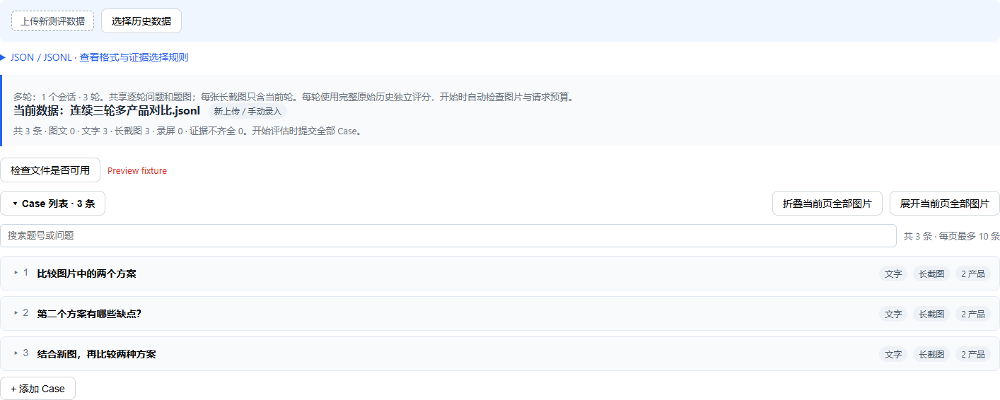
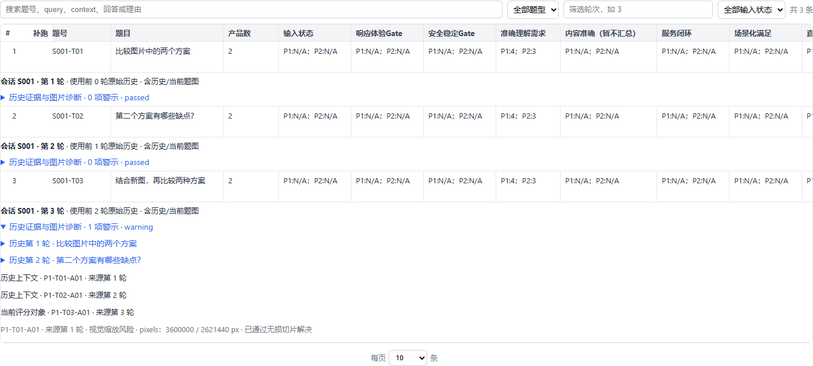

# 多轮长截图对比实施说明

实现基线：`feat/multi-turn-compare` 的 `d73c7c1`。需求来源：[`multi-turn-compare-design.md`](multi-turn-compare-design.md)。

本次确认的数据口径是：各产品连续三轮对话，每个产品每轮一张仅包含当前回答的长截图；各产品收到相同的问题和题图。代码支持连续 1～N 轮，实际容量由完整历史请求的图片和上下文预算决定。

## 使用

在现有“垂域视觉对比”页面导入 JSON 数组或 JSONL。每行是一轮，须同时提供 `id`、`session_id`、从 1 开始的 `turn_index`，并明确声明 `screenshot_scope: current_turn`。同一会话固定产品数量和产品位置。

```json
[
  {"id":"S001-T01","session_id":"S001","turn_index":1,"query":"比较这两个方案。","product_count":2,"screenshot_scope":"current_turn","screenshot1":"data/S001/p1-t1.png","screenshot2":"data/S001/p2-t1.png","query_images":["data/S001/question1.png"]},
  {"id":"S001-T02","session_id":"S001","turn_index":2,"query":"刚才第二个方案有什么缺点？","product_count":2,"screenshot_scope":"current_turn","screenshot1":"data/S001/p1-t2.png","screenshot2":"data/S001/p2-t2.png","query_images":[]},
  {"id":"S001-T03","session_id":"S001","turn_index":3,"query":"结合新图再比较。","product_count":2,"screenshot_scope":"current_turn","screenshot1":"data/S001/p1-t3.png","screenshot2":"data/S001/p2-t3.png","query_images":["data/S001/question3a.png","data/S001/question3b.png"]}
]
```

示例路径需要替换为真实文件。相对路径以项目根目录为基准；外部回答截图目录沿用 `OPERATION_VIDEO_ROOTS`，外部题图目录沿用 `query_images.allowed_roots`。

`query_images` 只填写本轮新增图片。第二轮即使数组为空，裁判也会收到第一轮原始题图。第三轮收到前三轮的用户输入，以及各产品各自前三轮的回答证据，只评价第三轮。

页面开始评估时自动调用 `POST /api/compare/preflight`，使用与提交相同的模型、协议和输入。预检查不调用模型；阻断时展示诊断，不提交评估。正式执行仍重新验证证据，前端检查不能绕过后端校验。

## 已实现

| 范围 | 行为 |
| --- | --- |
| 导入 | 支持乱序输入；拒绝缺轮、重复轮次/题号、字段半声明、产品数变更、未知截图范围和分产品不同追问。无效记录使其整个会话被拒绝；无法归属的语法错误阻止不完整批次导入。保留原始 `source_data`。 |
| 多轮录屏 | 在字段清理和证据选择前拒绝录屏、混合媒体和外部伪造派生截图；不能因截图齐全而悄悄丢弃视频。 |
| 原始历史 | `ConversationIndex` 从完整数据集取 `[1..target_turn]`；每产品轨迹独立、题图共享一次。不读取评分、Gate、理由或 `turn_summary`。 |
| 图片准备 | 固化原图、校验 SHA-256；长图全宽无重叠 PNG 切片；普通题图超限阻断。恢复时校验原图和切片，缓存不替代完整性检查。 |
| 裁判 | 新增 `compare-conversation-1` 适配器；保留所选 V0.2/V0.3 等协议的分数范围、输出 Schema 和后处理，不修改稳定单轮 Prompt。 |
| 限制档案 | 冻结供应商、模型、接口、视觉开关、已核验约束和本地保护值。分别记录原文件字节、Data URI 字节、有效像素风险；原图超限但切片解决后仍保留警示。 |
| 请求预算 | 纯文本会话和本轮无新题图时也检查完整历史图片数、编码体积、请求体与输入/上下文 Token 估算。不丢历史、不缩图、不换模型。 |
| 运行恢复 | 全量、暂停恢复、失败补跑和追加共用原始历史准备入口；前轮裁判失败不阻断后轮。补跑只选择目标轮，不展开评分依赖。 |
| 输入修订 | 多轮任务禁止原地覆盖已有记录或更改产品映射；允许完整连续的合法追加。修订历史输入应新建任务。 |
| 审计 | 持久化会话、轮次、有效输入类型、前缀/请求指纹、图片诊断、限制版本和请求预算；失败结果同样保留诊断。SSE 重连回放图片诊断。 |
| 页面 | 会话展开、轮次/输入状态筛选、原始历史图片入口、模型预检查、运行中诊断与常驻结果诊断。 |
| 导出统计 | 保留原逐题结果，增加会话和诊断字段；增加“多轮会话统计”“图片检查明细”。同轮多张题图原图分别导出。增加轮次分组、含历史题图的有效输入分组和会话等权均分比值；各方向使用相同有效配对轮，不用会话比值的平均替代均值之比。原有 Bootstrap 使用会话分组。 |
| 人工基准 | 模板与导入/导出携带历史前缀指纹；缺少历史版本或历史不一致时不自动配对，不因 Query 一样而认定相同样本。 |

## 限制与迁移

- 本次明确支持 `current_turn`。累计长截图、产品间不同追问、多轮视频不支持；不会猜测本轮区域或降级为单轮。
- 未提供轮次（`turn_index` 缺失、null、空字符串或空白），且未明确声明多轮模式的旧输入默认按单轮处理。单独的业务 `session_id` 不会触发多轮，原始字段保留在 `source_data` 中，历史数据复用也不会将它重新变成多轮。非空轮次、`conversation_mode`、输入版本 2.0，或会话 ID 配合截图范围声明，会触发严格多轮校验；错误轮次和缺轮不会静默降级。旧业务字段若同时使用非空 `turn_index`，仍需改名为 `upstream_turn_index`。只存于 `source_data` 的历史字段不会作为正式多轮输入。
- 官方限制当前内置核验对象是百炼 OpenAI 兼容 Base64 接口的 Qwen3.5/3.6/3.7/3.8、Qwen3-VL 系列。依据：[阿里云视觉理解文档](https://help.aliyun.com/zh/model-studio/vision)，核验日期 2026-09-18。MB 字节换算明确采用保守十进制解释；本地限制单独记录。
- 未核验供应商或模型（包括直接使用仓库默认 SiliconFlow 地址）会明确返回 `image_limits_unverified`，严格原图多轮评估被阻断。不会把百炼阈值套用到其他供应商。部署需使用已核验的实际模型配置，或维护对应供应商的限制档案。
- 已知像素预算内直传不等于服务端逐像素恒等处理。Token 是保护性估算，实际 usage 仍按裁判调用日志记录。
- 会话统计没有新增自定义总分或会话冠军。人工评分准确性、位置互换、小批真实模型表现仍需真实数据实验，不能用确定性测试替代。

## 验证记录

使用 `C:/workspace/venv/Scripts/python.exe`，并显式设置 `PYTHONPATH` 为本工作目录的 `src`，确保没有误测其他 worktree。

- 新增 40 项后端确定性测试：三轮/三产品、原始题图继承、多图、原始字节、无损像素还原、无未来泄漏、不依赖裁判结果、第三轮独立恢复、追加指纹稳定、API 拒绝、预算边界、图片来源诊断、会话等权配对、XLSX 多图和人工历史版本等。
- 全部 14 个 Node 前端测试脚本通过，包含多轮导入、模型预检查、阻断提交、历史复用和完整字段序列化。
- Playwright 使用真实页面与本地模拟数据检查会话视图、轮次筛选、历史证据区和图片警示，无浏览器脚本错误。
- 完整 Python 回归：810 项通过（包含已有视频路径测试，沙箱外运行本地 FFmpeg/FFprobe）。16 条现有 FastAPI/OpenPyXL 警告，不影响通过；测试均未发起真实模型调用。




