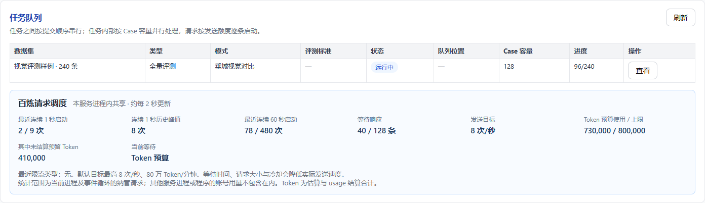

# 百炼请求发送限制与自适应吞吐

后续单任务性能优化、最新预算语义及阶段计时见 [单任务吞吐优化](task-throughput-optimization.md)。

本次基于远端 `feat/bailian-request-throughput` 的 `105dae7` 实现，保留新增的校准版评测协议。此文替代旧吞吐文档中关于发送入口、Token 结算和页面限流信息的描述。

## 页面容量与请求速率

页面的 Case 并发容量范围仍为 1–128。它控制任务内同时处理的题数，不是每秒调用次数。独立 Case 持续补入，同一多轮会话按轮次顺序执行，任务之间仍为 FIFO。视频抽帧、长截图准备和图像编码共用 4 个预处理槽位；按题目顺序优先推进较早题目的后续准备阶段，避免第一题的编码排到全部待抽帧题目之后。模型调用期间不占用预处理槽位。

目标模型 `qwen3.5-397b-a17b` 使用已识别的百炼官方 DashScope/MAAS 地址时启用共享流控。不同 Key、客户端、首次请求、失败重试、usage 参数兼容重试和 JSON 修复均经过同一控制器。

| 限制 | 初始值 | 最高配置/自适应值 |
| --- | ---: | ---: |
| 任意连续 1 秒的 HTTP 请求数 | 9 | 9，普通页面不可修改 |
| 请求发送目标 | 8 次/秒 | 9 次/秒 |
| 连续 60 秒请求预算 | 480 | 540 |
| Token 估算预算 | 800,000 | 900,000 |
| 未完成请求容量 | 128 | 128 |

平滑发送间隔额外保留 1 ms 余量，并受 Token 消耗、冷却和滚动窗口共同约束。空闲不会累积可集中消费的发送许可，事件循环暂停后不补发错过的额度。启动及超过 30 秒的真正空闲后，从目标速率的 25% 开始，15 秒逐步恢复。等待发送额度、等待连接或仍有模型响应在途时不算空闲，避免大请求反复重置预热而长期停留在 25% 速度。

## 真正发送前检查

HTTPX 请求钩子先进入共享发送队列，在建立连接前等待预计可用的请求数、Token 和在途额度。这一阶段不计入请求次数，也不预支发送许可，避免大量请求提前建连后因长时间等额度被网关关闭。

每次仅一个候选请求进入连接池、TCP/TLS 阶段；实际许可仍在 HTTPcore 的 `http11.send_request_headers.started` 事件检查并取得。共享发送锁持有至请求头完成/失败，不等待响应正文。完成写入时保守更新发送时间和下次允许发送时刻，避免建连或 socket 写入过程中的暂停导致旧许可集中放行。模型的流式响应保持异步并行。

HTTP/2 的共享连接写锁位于该事件之后，因此本实现明确使用 HTTP/1.1。HTTPX 使用有界连接池，并保留环境代理/证书设置。HTTPS 代理的 CONNECT 不作为模型调用计数；发生 HTTP 跳转时，后续实际请求仍重新经过入口。SDK 自动重试关闭。

实现依赖 HTTPX 0.28.x / HTTPcore 1.0.x 的 trace 行为，依赖范围已在 `pyproject.toml` 中限定，并用真实本地 HTTP/1.1 服务测试。后续升级依赖应重跑传输测试，不可只运行 MockTransport 测试。直接自行创建的 OpenAI SDK 客户端不能传入百炼限流器绕过该入口。

## Token 与超时

请求时间戳和 Token 账本独立存储，输出结算不会增加 RPM/RPS 计数。收到成功 HTTP 响应头后，输入转入独立 60 秒窗口；尚未确认的输入和未完成输出继续预留。收到 usage 后结算实际输入和输出。无 usage 的失败或取消恢复完整保守预留，避免本地释放后立即超发。

文本使用固定版本的本地 Qwen 分词器加余量，图片仍保守估算；输入/输出估算根据返回 usage 校正。请求数限制可在本地准确计数，Token 预算是估算，不能视为服务端真实 TPS 计量。大图和长输出仍可能触发 Token 限流。

本地发送额度和发送锁的等待不消耗单次调用或外层 Case 的执行超时；等待期间仍可取消。TCP/TLS、实际请求头写入、响应等待和模型生成仍受执行/网络超时限制。取消会清理持有的锁、槽位和请求上下文，已发生的请求不会从窗口中退款。

## 错误反馈与管理配置

请求数限流、Token 限流、增速限制及服务拥塞分别处理。相同一波在途错误只进行一次降速；共享冷却遵守 Retry-After，重试重新排队经过相同限制。默认不开启超过初始保守预算的自适应升档。

仅在确认账号调用均已纳管、具有相应配额后，管理员可设置 `AUTO_EVAL_BAILIAN_ADAPTIVE=true` 开启健康升档。请求/Token 上限可通过 `AUTO_EVAL_BAILIAN_RPM`、`AUTO_EVAL_BAILIAN_TPM` 配置，不能突破 540 / 900,000。具体输入校验与健康条件以 `request_throttle.py` 为准。

平台提供只读 `/api/request-pacing` 状态，页面将 Case 容量与请求发送频率分开展示。观察最近滚动窗口请求数、等待响应数量、Token 预留、冷却及实际等待原因，评估性能应优先看成功 Case/分钟。



## 保证范围与部署

本次落地设计中的单进程阶段：同一进程、同一事件循环内统一流控。多进程、多台服务器、同账号其他程序不会自动共享预算；请使用单 worker 启动。若要扩展部署，必须让该账号模型的调用经过统一发送网关，不能每个进程各自使用 9 次/秒。

重启会重建内存中的控制器。应先排空旧任务、确保旧发送器停止，并让旧窗口用量消退后再启用新实例，不能让新旧实例交叠发送。本实现没有新增 Redis、分布式网关或自动服务重启。

保证针对本地受控出口的发送过程，网络到达间隔不完全受客户端控制，不能承诺所有 429 消失。官方存在请求数、Token 和动态增速限制。同账号未纳管调用、账号实际配额较低、大请求 Token 突发仍需依据错误类型处理。

## 验证方式

### 大批量任务启动停滞回归

152 条任务、Case 容量 128、媒体容量 4 的回归复现了旧 FIFO 媒体队列的问题：第一条模型调用要等约 128 条完成初次媒体准备。改为按题目优先级推进后，首批题目可以在后续题目仍排队抽帧时开始评测；预处理总并发仍不超过 4。普通 V0.2、V0.2 评分校准版和 V0.3 共用这条调用链，历史快照的更新时间随媒体准备保存而变化，不等同于模型重试。

传输回归还覆盖“网关关闭迟迟不发请求头的空闲连接”：长时间额度等待应发生在建连之前，并继续满足真实请求头发送窗口、重定向和取消清理约束。以上使用合成媒体和本地 HTTP 服务；判断服务器上的具体任务仍需结合该实例的 `/api/request-pacing` 和运行日志。

大请求回归使用每次 500,000 Token 的估算值，复现并修复后续发送间隔错误地一直保持约 150 秒的问题；预热结束后恢复为预算对应的约 37.5 秒。该数字仅说明限速计算结果，不是模型耗时实测。状态接口的 `pending` 现在包含等待发送锁的全部请求，`target_rps` 是目标上限，并不表示实际每秒已发送的数量。

```powershell
$env:PYTHONPATH = 'C:\workspace\auto_eval_vqa\src'
& C:\workspace\venv\Scripts\python.exe -m pytest -q tests/test_request_throttle_core.py tests/test_request_transport.py tests/test_request_throttle.py
node tests/test_request_pacing_ui.cjs
```

核心测试覆盖严格滚动秒窗口、取消、Token 结算、长响应、冷却与自适应。传输测试使用本地 HTTP/1.1 服务验证连接池积压、并发流、集中重试和取消，不调用真实模型。已有评测协议、VQA、长截图、复用和 Excel 导出回归应一并通过。

前一版（`39d8bc1`）验证：共378项Python测试，由全量与专项覆盖；6个Node前端测试脚本通过。真实Vue页面使用合成状态完成截图检查，无脚本错误。重定向重复trace自锁问题使用真实307跳转、连接池/在途容量均为1的测试验证。

本次启动停滞修复：最终全量离线回归398项通过（66.80秒，4条既有FastAPI弃用提示）。新增20项覆盖152题媒体流水线、三个评测协议及两种证据模式、真实SDK到评分校准裁判的本地HTTP调用、网关空闲连接关闭、连续大请求/慢建连预热，以及预处理许可交接和取消清理。未调用真实模型，也未操作服务器上的运行任务。

旧离线模型的约 215 秒降到 196 秒依赖固定更高预算和完全准确的 Token 估算，本次长期未结算预算处理更保守，且自适应默认关闭，因此不能将该数字当作此实现的实测加速。生产控制器的模拟测试保留可复现结果；实际收益需结合真实请求长度、响应延迟与配额测量。

2026-09-15 本次生产控制器虚拟时钟测试：240 条、单次30秒、每次10,000 Token，默认保守档约230.49秒，相对于容量10的720秒基线约3.12倍。旧控制器同场景约215.47秒，因此此版本默认档更侧重计量正确与限流约束，不能宣称相对旧控制器默认档更快。真实模型性能尚未测试。

官方依据：[限流规则](https://help.aliyun.com/zh/model-studio/rate-limit)、[限流应对最佳实践](https://help.aliyun.com/zh/model-studio/rate-limiting-best-practices)。
