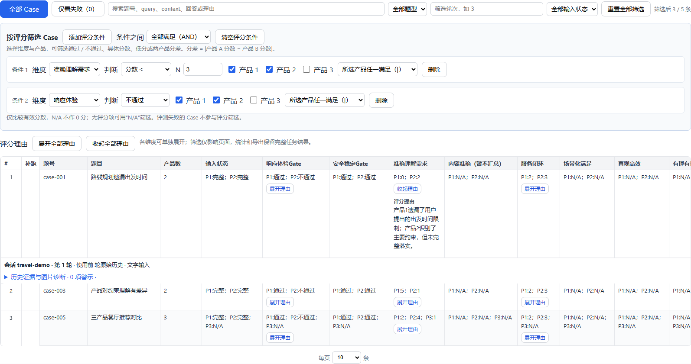

# 结果筛选与评分理由

在“③结果”的“按评分筛选 Case”中添加条件，即时更新下方结果表及分页。

## 判断方式

- 响应体验、安全稳定：按原始 Gate 的通过、不通过、不清楚或无结果筛选。
- 七个评分维度：准确理解需求、内容准确、服务闭环、场景化满足、直观高效、有理有据、引导推荐。支持等于、小于、小于等于、大于、大于等于和无分数 / N/A。
- 两产品分差：选择一个评分维度、恰好两个产品和阈值 N，筛选 `abs(产品 A 分数 - 产品 B 分数) <= N` 的 Case；N 为 0 时只显示同分 Case。

每条条件可选择产品 1、2，以及三产品任务的产品 3。选择“所选产品同时满足（&）”表示所有所选产品均符合该条件；“所选产品任一满足（|）”表示至少一个产品符合。不同条件之间也可选择全部满足或任一满足。

示例：

| 目标 | 条件 |
| --- | --- |
| 产品 1 或产品 2 的理解需求低于 3 分 | 准确理解需求；分数 < 3；产品 1、2；任一满足 |
| 两产品响应体验都不通过 | 响应体验；不通过；产品 1、2；同时满足 |
| 产品 1 得 1 分，产品 2 得 4 分 | 两条同维度条件分别选择对应产品及分数；条件之间全部满足 |
| 产品 1 和产品 3 的服务闭环分差不超过 1 | 服务闭环；两产品分差 ≤ 1；产品 1、3 |

不为数值维度定义隐含及格线，按各历史任务保存的原始评分比较。分差和数值筛选只计算有效分数；缺失、不可用、不适用的分数不会补 0。产品不存在时不会命中，包括 N/A 筛选。技术性评测失败与 Gate 不通过不同，失败 Case 通过原有“仅看失败”查看，不参与评分条件判断。

多个评分条件与搜索、题型、轮次、输入诊断及失败筛选叠加。条件缺少数值或产品时显示错误提示，不执行不完整筛选。可单独删除条件、清空评分条件或重置全部筛选；切换历史任务或新建评测时清空筛选。

筛选仅影响网页显示。统计及 CSV、JSON、Excel、证据导出仍保留完整任务数据。多轮任务按当前轮结果匹配，完整会话历史和证据保持可查看。

## 评分理由

各维度分数和 Gate 状态保持显示，理由默认收起。点击某个单元格的“展开理由”可查看完整文字；响应体验和安全稳定按产品展示各自理由，数值维度展示该维度的综合评分理由。没有记录理由时不生成替代解释。

可使用“展开全部理由 / 收起全部理由”控制所有页，仍可单独切换某个单元格。单产品模式的卡片、链接、问题解决及复核原因也支持收起。折叠不影响理由搜索，不修改评分或导出。

## 验证

前端回归覆盖九个维度、产品 AND/OR、条件 AND/OR、绝对分差边界、零分、N/A、不适用、三产品、无效输入、理由折叠、搜索、分页和切换历史任务。使用模拟结果，不调用模型。

2026-09-23 验证：888 项 pytest 测试通过（885 项主回归与 3 项本地 FFmpeg 媒体测试），16 个 Node 前端脚本通过。浏览器使用模拟数据验证产品组合、分差筛选、三产品、Gate、多条件、单独/全部折叠及窄屏控件布局；无页面脚本错误。
