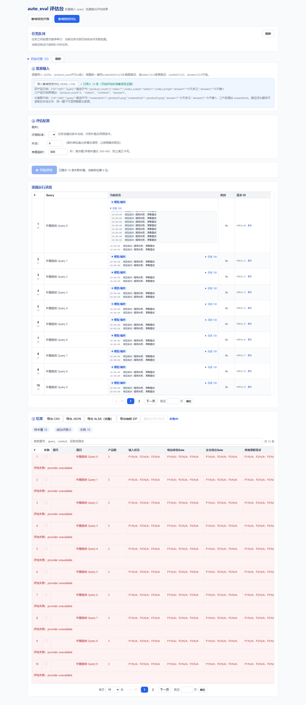

# 失败补跑导致页面无响应：排查与修复记录

记录日期：2026-09-10。修复分支：`feat/long-screenshot-evaluation`。

## 现象与影响范围

任务完成但存在失败项时，用户点击失败补跑，页面可能在补跑开始执行后卡住，并出现浏览器“页面无响应”提示。用户报告约十几条失败项，点击按钮后并非立即卡死。

长截图和录屏共用任务事件流、进度表和日志展示逻辑，因此两种输入模式均受影响。打开正在补跑的历史任务、事件流断线后重连，也会经过相同的历史回放路径。

本次使用模拟任务在本地浏览器复现了页面阻塞；没有使用线上失败任务，也没有调用真实百炼模型。该结论说明代码中存在足以引起卡顿的路径，不表示已经排除了线上网络、资源占用等其他因素。

## 调用链与原因

调用链：`retryFailedCases()` → `POST /api/eval/{task_id}/retries` → `connectSSE()` → `GET /api/eval/{task_id}/stream` → 页面事件处理与 Vue 渲染。

1. **历史日志逐条回放放大了渲染次数。** 服务端每次建立连接都会逐条发送所有题目的历史日志，再发送最新进度和已有结果。即使只补跑少量失败项，也会回放整个任务的记录。
2. **每条事件引发过量计算。** 前端通过展开运算复制整个进度或日志对象；进度表先遍历全部题目，并逐题在线性结果数组中查找，再截取当前页。这导致单次全表计算随任务规模增长，最坏达到平方级查找开销。
3. **日志收起后仍然渲染。** `<details>` 收起只影响显示，内部日志节点及格式化表达式仍然执行。每页最多 10 条题目、每题 100 条日志，可能同时维护约 1,000 条隐藏日志。时间格式化还反复创建本地化格式器。
4. **历史日志缺少前端去重键。** 历史快照直接赋值，没有补齐 `_key`，重连回放时同一批事件可能再次进入列表，造成额外更新。
5. **旧结果覆盖补跑状态。** 旧协议先回放当前进度，再回放原有失败结果；前端把后者当作刚完成的结果，可能将正在补跑的题目重新标记为失败。补跑还可能沿用旧阶段、开始/结束时间，或显示原结果的耗时。
6. **相关异步状态错误。** 旧连接的事件只按任务 ID 过滤，无法区分同一任务的新旧连接；日志展开回调在 `nextTick` 中读取已失效的 `event.currentTarget`，可能抛出空对象访问异常。

## 修复内容

| 文件 | 修改 |
| --- | --- |
| `src/auto_eval/web/server.py` | 为 SSE 增加可选 `compact=true`：一次 `replay_state` 恢复结果与当前进度，之后每题一条 `progress_history` 批量恢复日志；回放前订阅并固定快照，期间新增事件继续按队列顺序发送。 |
| `src/auto_eval/web/static/app.js` | 启用批量回放；只计算当前页进度；结果按 index 建立查找表；按题更新状态；统一历史日志键和去重；复用时间格式器；按新 request_id 重置补跑阶段与计时；忽略过期序号和已关闭连接的事件；保存日志 DOM 引用供异步回调使用。 |
| `src/auto_eval/web/static/index.html` | 完整日志只在展开时渲染；按题保存展开状态；更新脚本版本参数。 |
| `src/auto_eval/web/runner.py` | 仅在 request_id 相同时继承开始时间，避免新一轮补跑沿用旧请求计时。 |
| `tests/test_web_retry.py` | 覆盖批量/旧协议回放、回放期间实时事件、订阅清理、补跑计时及前端回归脚本。 |
| `tests/test_web_retry_progress.cjs` | 使用实际页面处理函数和模拟 HTTP/SSE，验证双/三产品、长截图/录屏、历史任务、状态隔离、日志去重、分页计算范围及日志展开回调。 |

默认 SSE 请求仍保留原有逐条回放协议，旧页面和已有调用方可继续使用。新页面需要与本次后端代码一起部署，才能启用批量回放。

没有修改任务输入格式、持久化结构、评分 Schema、Prompt、百炼请求配置或 Excel 导出列，也没有新增生产依赖。

## 复现与浏览器验证

本地使用 Chrome、Vue 3.5.21 和模拟 HTTP/SSE：准备 15 条失败项，每条保留 100 条历史日志；加载失败状态后调用实际补跑函数，依次发送历史事件，再发送 150 条补跑进度。逐条事件间保留微任务边界，让 Vue 执行更新。另验证新协议批量回放、日志展开以及进度表翻页。

| 验证场景 | 结果 |
| --- | --- |
| 修复前，15 条 × 100 条历史日志 | 浏览器测试超过 30 秒未完成，由测试超时机制关闭。 |
| 修复后，长截图逐条回放 1,500 条日志 | 约 82 ms。 |
| 修复后，长截图批量回放同等历史 | 约 74 ms。 |
| 修复后，录屏批量回放同等历史 | 约 77 ms。 |
| 修复后，150 条补跑进度 | 长截图约 476 ms，录屏约 483 ms。 |
| 默认收起日志 | 当前页仅渲染 20 条最新日志预览。 |
| 展开完整日志、切换页码再返回 | 正常，无页面脚本异常，展开状态未串到其他题目。 |

以上为本地模拟数据下的测量值，不是线上时延承诺；真实日志长度、任务总量和浏览器性能会影响结果。

下图是模拟三产品长截图任务补跑中展开日志的验收截图；下方结果表保留原失败结果，等待补跑成功后替换。



## 自动化测试

在仓库根目录执行以下 PowerShell 命令，使用工作区指定的 Python 环境：

```powershell
$env:PYTHONPATH='C:\workspace\auto_eval_agent\src'
& C:\workspace\venv\Scripts\python.exe -m pytest -q -p no:cacheprovider tests/test_web_retry.py tests/test_web_queue.py tests/test_observability.py
& C:\workspace\venv\Scripts\python.exe -m pytest -q -rs -p no:cacheprovider
```

结果：专项 **21 passed**；全量 **145 passed, 2 skipped**。全量测试耗时约 20 秒，另有 4 条已有的 FastAPI `on_event` 弃用警告。

两项跳过位于 `tests/test_media.py`，原因是本机未安装 `ffmpeg` 和 `ffprobe`。录屏的页面、事件流和历史任务兼容测试已经运行，但依赖真实外部工具的两项媒体测试未运行。前端回归脚本使用 Node.js，可通过下列命令单独运行；它不需要浏览器、额外 npm 安装或真实模型网络请求：

```powershell
node tests/test_web_retry_progress.cjs
```

## 部署与后续验证

同步上述 4 个生产代码文件，重启后端并刷新页面，使浏览器加载新版本脚本；无需调整 `config` 或迁移历史任务。端口继续使用 8054。

部署后应使用原来触发问题的失败任务验证补跑，检查页面能否持续交互、进度是否随新请求推进，以及日志展开和翻页是否正常。本次尚未完成线上实际任务复测。
