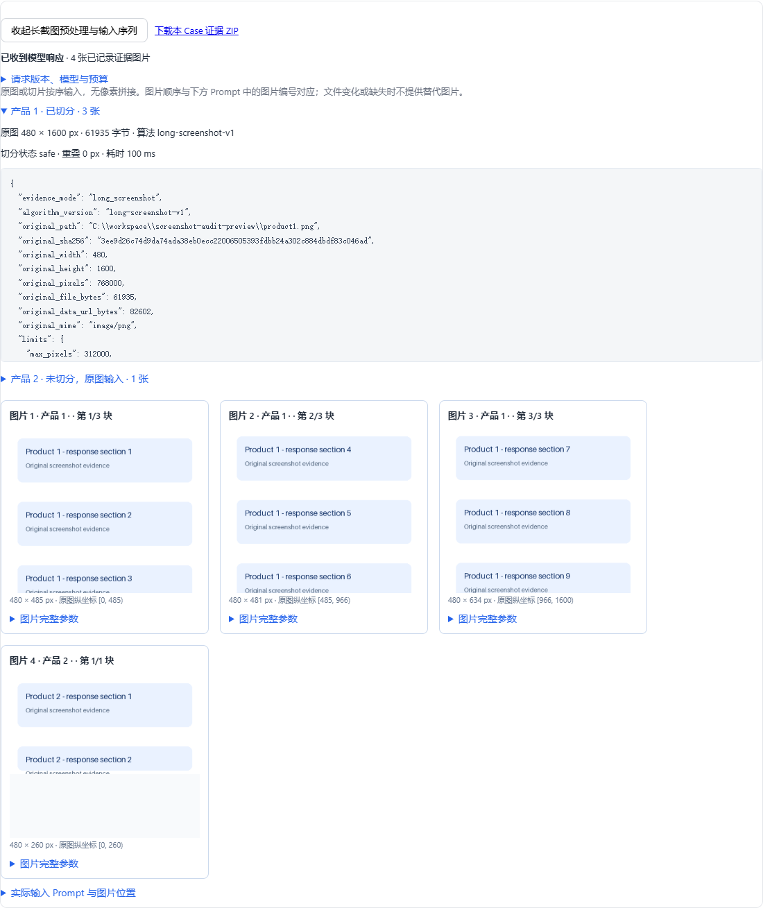

# 长截图证据审计与下载

本功能基于 `feat/multi-turn-compare`，覆盖单轮与多轮长截图，不改变评分标准或图片顺序。

## 数据设计

- `screenshot_metaN` 保存每张回答原图的尺寸、文件字节数、Base64 长度、SHA256、限制配置、算法版本、处理耗时、是否切分、切分状态、边界坐标和风险、切片顺序与各片尺寸/哈希。新增 `processing` 记录不缩放、无像素拼接、全宽纵向切分、边界检测参数和切分优化目标。
- 每个评测目标在 `task.items[index].screenshot_evidence` 保存版本 `screenshot-evidence-1`。记录实际 System Prompt、完整 User 文本/图片位置序列、图片序号和角色、原始引用路径、固定证据路径、实际图片字节的哈希、协议/模型和请求指纹；不保存 Base64 字符串。
- 实际编码后的图片字节固化到 `runs/screenshot_evidence/<sha256>.<ext>`，相同内容复用。截图不切分时保存原图字节，切分时保存送入模型的无损切片；请求中有题图时同时保留模型看到的题图。不会把切片再次像素拼接，也不会同时把原图和其切片重复作为证据输入。
- 模型调用前保存记录；`assembled` 表示已组装，`model_call_started` 表示开始调用客户端，`model_response_received` 表示收到响应。收到响应不代表评分解析一定成功；SDK 内部限流/重试不在此状态中展开。补跑保存本次最新请求记录，已有调用日志继续保留调用历史。
- 多轮记录包括该评分目标的完整原始前缀，图片标明 `source_turn` 和 `request_role`。后续轮次不会进入早期轮次的记录。
- 历史任务没有请求记录时只展示已有 `screenshot_metaN`，标为 `request_not_recorded`；不重建/伪造当时 Prompt 或多轮历史图片顺序。准备失败时已有字段可查看，未生成的参数显示未记录。

## 页面与接口

加载任务后的结果列表新增“查看长截图预处理与输入序列”，按需加载参数、原图/切片序列和 Prompt，不在加载任务时预取所有切片。每个 Case 和任务整体都有长截图输入证据 ZIP 链接。

- `GET /api/eval/{task_id}/items/{item_index}/screenshot-evidence`：读取当前保存的证据记录。
- `GET /api/eval/{task_id}/items/{item_index}/screenshot-evidence/{image_no}`：校验授权路径、哈希和图片格式后返回图片。
- `GET /api/eval/{task_id}/export?format=screenshot_evidence`：任务级 ZIP。
- `GET /api/eval/{task_id}/items/{item_index}/export?format=screenshot_evidence`：单目标 ZIP，多轮时包含该目标已记录的历史图片。

ZIP 图片名采用 `case_0001/image_0001.png`，与 `manifest.json` 请求图片序号对应。清单还包含预处理参数、完整 Prompt、历史来源和下载状态。缺失、变化、无哈希或越权的文件不进入 ZIP，只记录不可用原因。ZIP 按图片处理并写入磁盘，临时 ZIP 在响应结束后清理。

## Excel

保留现有工作表，新增：

| 工作表 | 内容 |
| --- | --- |
| 长截图预处理参数 | 目标 Case、来源轮次、产品、是否切分、原图尺寸、切片数量、完整预处理 JSON |
| 长截图请求图片序列 | 实际图片序号、产品/题图、历史/当前轮、坐标、尺寸、哈希、完整图片元数据 |
| 长截图Prompt明细 | 请求状态/协议等参数、完整 System Prompt、逐段 User 文本及图片位置 |

长文本每 14000 个字符分段，避免 Excel 单元格 32767 UTF-16 单元限制导致静默截断。按“请求位置”和“分段序号”连接可还原完整内容。

## 验证

自动测试覆盖原图/切片字节与实际请求一致、Excel 长文本还原、源文件替换后固化证据仍可下载、缺失/变化/越权拒绝、模型失败记录、多轮历史顺序、旧记录降级和前端加载取消/重试。浏览器验证任务加载、参数展开、四张有序证据图、Prompt 图片占位与单 Case ZIP 下载。

验证结果：864 项 Python 测试通过，15 个前端测试脚本通过；未调用真实模型。

界面截图：
