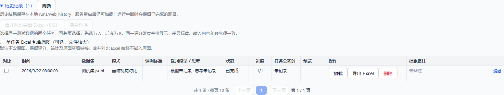

# 同测试集任务对比导出

适用于同一测试文件使用不同裁判模型，或使用不同测评 Prompt 版本后，比较两个任务的逐题结果。支持当前的垂域视觉评测和垂域视觉对比模式，包括多轮会话。

## 使用

在历史记录中勾选两个任务，点击“合并对比导出 Excel”。选择可以跨页保留，先选的任务为 A，后选的为 B；可清空后重新选择。原有单任务导出入口保留。

单任务导出可在历史记录或结果区勾选/取消“单任务 Excel 包含原图（可选，文件较大）”，两处共用当前页面的选项，默认不勾选。不勾选时不会嵌入回答长截图或提问图片，但仍保留评分、统计、图片清单、证据审计文本和已有原图查看链接；下载文件名增加 `_不含原图`。合并对比导出本来就不嵌入原图，不受此开关影响。

后台导出 `POST /api/eval/{task_id}/exports?include_images=false` 和直接下载 `GET /api/eval/{task_id}/export?format=xlsx&include_images=false` 均支持无图版本；省略参数默认不包含原图；需要原图时显式传 `include_images=true`。生成中的有图/无图请求分别去重，导出状态包含 `include_images`，提交后修改页面选项不会改变已提交的导出。

Excel 包含：

- **逐题对比**：一条输入一行；每个结果字段以 `字段 · A`、`字段 · B` 相邻排列，差异标黄。顶部冻结标题，左侧冻结序号、题号、题目，并支持筛选。
- **共同测试数据**：保留输入内容及额外业务字段。
- **任务说明**：记录 A/B 任务 ID、备注、模型运行信息、协议修订、评分范围与输入内容指纹。逐题结果保留原有的 Prompt SHA256 等信息。

失败和未完成的 case 保留独立状态及错误，不填成零分。不同 Prompt 版本如果使用不同评分范围，应分别解读原始分数；此功能不做归一化。合并表聚焦结果对比，可通过长截图查看链接打开原图；需要嵌入图片时使用单任务完整导出。

## 长截图查看链接

通过网页导出时，单任务的“逐题结果”“数据集明细”和合并导出的对应表中，增加已有原图的 `产品N长截图查看链接`。合并结果仍以 A/B 相邻列展示，分别指向各自任务的原图。单元格包含完整 HTTP(S) URL 和 Excel 超链接关系，不使用 HYPERLINK 公式。

地址格式为 `服务地址/api/eval/{task_id}/items/{item_index}/screenshots/{product_no}`，其中 case 索引从 0 开始，产品编号为 1、2、3。点击后由原有接口返回原图，保留授权目录、图片格式和已记录 SHA256 校验；视频回退任务仍可查看其输入中提供的原图。

默认使用导出请求的服务地址。生产部署或反向代理环境可设置 `EXPORT_PUBLIC_BASE_URL=https://你的域名/路径前缀`，使下载到其他电脑的 Excel 指向可访问的部署地址。直接调用 Python 导出且没有请求上下文时，需要设置此环境变量或在快照中传入 `export_base_url`，否则不生成链接。不要使用其他电脑无法访问的 localhost 地址。

该链接不依赖页面预览的短期 token，没有固定过期时间；但服务需在线、历史任务和原文件需保留，访问者需能访问该服务。链接不代表向外部对象存储上传图片，也不能替代离线保存的完整 Excel。

## 对齐规则

两侧评测模式、case 数量必须相同，逐行校验原始输入内容及会话 ID、轮次。文件名不作为同一测试集的依据；即使文件同名，只要某一行内容或顺序不同也拒绝合并，并指出首个不匹配的位置。

优先使用持久化的 `source_data`，避免抽帧缓存等运行时数据影响判断。老任务没有该字段时使用现有历史导出的输入回填规则，采用保守校验。相同位置的重复题号允许存在，按输入索引对齐；只有唯一题号才可用于旧结果的题号回填。

## API 与实现

`POST /api/exports/comparison`，请求体 `{"task_ids": ["任务A", "任务B"]}`，返回 202 和导出任务状态。必须传入两个不同且非空的任务 ID。

沿用 `GET /api/exports/{export_id}` 查询、`GET /api/exports/{export_id}/download` 下载。任务加载和输入校验在后台执行，错误由导出状态返回。两侧结果在生成开始时分别复制为快照，支持运行中或部分失败任务，后续重试不会修改已生成文件。

单任务和双任务导出共用容量限制、后台线程、30 分钟过期清理。双任务去重键包含有序的两个任务 ID，与单任务导出互不混淆。生成过程不调用模型，不进入评测队列。

## 多人同时导出（2026-09-22）

- 网页后台导出、双任务合并导出和旧的直接下载入口共用同一队列，最多接受 4 个未完成的导出，其中 1 个生成、其余等待。等待使用异步机制，不占用工作线程。状态中的 `queue_position` 表示等待队列序号，页面会显示该序号。
- 队列满时立即返回 HTTP 429 和“导出队列已满，请稍后重试”，附带 `Retry-After: 3`。某一导出失败会释放生成名额，后续任务继续处理。
- 相同任务、相同图片选项和相同服务地址的未完成请求复用一次生成；不同任务使用独立文件，避免覆盖和内容混淆。一个直接下载请求取消，不会取消其他用户共用的后台生成任务。
- 下载开始时保护文件，直到所有正在下载该文件的请求结束后才允许清理；过期清理、完成记录数量清理和正常关闭均遵守该规则。传输异常或请求取消也会释放保护，避免文件一直被保留。

以上适用于平台现有的 **单进程部署**。多个人同时访问同一实例受上述队列保护；多个 Uvicorn worker 或多个服务实例之间尚未共享任务/导出状态，不能用增加 worker 数的方式扩展导出能力。

回归测试覆盖 12 个不同任务同时请求、20 次重复请求、队列满时访问其他 API、并行下载内容隔离、旧入口共用队列、失败后的队列恢复，以及下载中清理和连接中断。测试使用模拟任务和文件，不调用模型；用于验证并发正确性，不代表生产环境容量压测。
