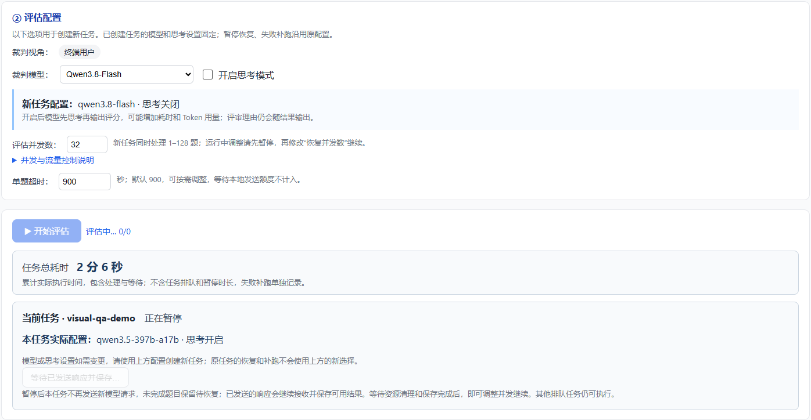

# 任务暂停与调整并发恢复

## 目标与交互

任务执行过程中点击「暂停任务」，保留已完成记录；稍后从历史记录打开原任务，设置「恢复并发数」，点击「继续执行原任务」。恢复使用相同 task_id，结果、导出、历史记录继续归属于原任务。

并发数支持 1–128 的整数，每次恢复创建新的执行信号量。恢复请求不接受修改输入、模型选择或评分协议，沿用原任务参数及既有协议解析规则；恢复并发仅对本次执行生效。原执行参数保留，实际使用的恢复并发记录在执行审计中。

## 暂停语义

- 采用协作式暂停，以实际模型请求发送为边界。暂停请求到达后，本任务不再发送新的模型 HTTP 请求，包括等待媒体处理、额度、在途槽位或连接后准备发送的请求，以及后续重试、usage 兼容重试和 JSON 修复。已经取得 Case 并发槽不代表可以继续发送。
- 已发出的请求继续接收响应、结算 usage，并保存可用评测结果。若还需要新的模型调用才能完成本题，则保留为待恢复，不增加完成/失败计数；已经缓冲的调用明细照常保存。尚未完成的媒体准备会协作退出，释放线程、子进程及槽位后才完成暂停。
- 页面先显示「正在暂停」，等所有运行批次退出且最终快照保存成功后，显示「已暂停」。已经发出的响应仍可能继续返回；正在建立的连接可能需要等其网络超时，但连接后仍会在发送前拦截。暂停不撤销已经送往服务端的请求。
- 排队中的任务直接移出 FIFO 等待队列，保存为 paused。其他任务可以继续调度。
- 暂停期间拒绝恢复和新增更新批次；保存失败时保留内存对象并提示重试保存，不宣称已经持久化。
- 暂停属于可导出、可查看历史、可生成人工评分对比快照的终态。人工对比快照保持冻结，不随之后恢复写入的结果变化。

## 恢复选择

默认选择没有结果的题目，以及上次执行明确留下的未完成补跑/更新项。已经保存的技术失败保留；勾选「同时重试失败项」后纳入恢复。成功结果默认跳过。

rich_content 多轮会话按 turn_index 串行执行。恢复利用已完成前序轮次的 turn_summary 重建上下文，移除旧运行注入的总结，避免重复拼接。重试某轮时，该会话从该轮开始的后续轮次也重算。compare 中各题相互独立，不因为 session_group 而扩展选题。

增量更新接口的每个批次独立保存剩余下标、有效参数和已经生成的前序总结。暂停后恢复原批次的串行顺序，旧评分不会掩盖尚未完成的更新。尚有待执行更新的题目拒绝重复提交更新，避免覆盖断点输入；互不重叠的批次仍可并行。恢复时普通题目按新并发执行，增量批次依次接续，批内维持原有串行语义。

## 状态与持久化

Task 增加 execution_control 字段，旧快照缺失时兼容为空：

| 字段 | 含义 |
| --- | --- |
| state | pausing / paused / queued / running / completed / interrupted / cancelled |
| requested_at / paused_at | 暂停请求和完成时间 |
| concurrency | 最近一次恢复的并发数 |
| pending_indexes | 已选择但尚未完成的恢复或补跑项 |
| update_batches | 增量批次断点及前序总结 |
| resumes | 每次恢复的 ID、幂等键、参数、题目下标、时间、完成数、失败数和状态 |
| save_error | 保存失败时保护内存记录并阻止恢复 |

沿用现有顺序后台写入和原子替换快照机制。正常暂停等待最终写盘后才发送 paused SSE 事件。原始记录在 results 中按下标更新，不创建重复任务；每次恢复有独立请求 ID 和审计记录。

服务异常退出后，原运行态转为 error/interrupted，允许用户手动恢复，不自动产生新的模型调用。只能保证恢复最后一次成功落盘的断点；异常退出前尚在内存的节流写入结果可能需要重新执行。正常暂停完成后没有这段窗口。

总耗时累计各次实际执行时长，排队及暂停时长不计入。已有失败补跑仍使用独立审计时间。并发额度、RPM/TPM 节流及媒体处理容量沿用原有机制；提高并发不一定提升实际吞吐量。

## API 与事件

`POST /api/eval/{task_id}/pause`：无请求体；返回 pausing 或 paused。重复请求不会启动新任务。

`POST /api/eval/{task_id}/resume`：

```json
{"concurrency": 8, "include_failed": false, "idempotency_key": "client-generated-key"}
```

恢复请求只接受上述字段。相同幂等键返回已有恢复记录；已在运行、正在保存或不存在候选项时返回 409。恢复任务进入原 FIFO 队列。

SSE 增加 pausing、paused；paused 是终止当前订阅的终态。replay_state 与历史详情返回 execution_control 和运行计数。前端保留已有结果，切换任务后忽略迟到的操作响应。

## 验证

2026-09-17 修复高并发暂停漏发：原实现只在取得 Case 信号量时检查一次暂停，128 并发下，大量题目会继续从媒体/发送队列进入模型。新增每题独立的暂停上下文，在准备、重试、共享限流及 HTTP 请求头发送前检查；暂停不会污染同一模型的其他任务，也不会将未发送请求记入 RPM/Token 预算。

修复后全量离线回归 724 项 Python 测试通过，12 组前端脚本通过。新增 17 项回归覆盖 24 题同时准备时暂停、真实媒体队列与线程回收、已发响应完整结算、HTTP 连接等待后拦截、额度/在途槽位等待、重试和 JSON 修复、暂停时调用明细保留与恢复不漏题。真实浏览器离线预览确认「正在暂停」提示，无页面脚本错误；没有调用真实模型或内网服务。

部署需同步完整 `src/`（包含新增 `auto_eval/task_control.py`）并重启实际服务进程，无需更换配置或安装新依赖。刷新页面后可看到新的暂停提示。暂停只作用于当前 `task_id`；其他排队任务继续执行是既有行为。



后端测试覆盖真实单题信号量的停止派发和在途排空、恢复并发、保留结果、重复暂停、进程重载、多轮总结、更新批次旧结果覆盖、排队暂停、幂等、非法并发、落盘失败保护及计时。前端测试覆盖暂停等待、恢复参数、结果保留、SSE 终态及切换任务竞态。

使用本地合成数据和假裁判做页面验收，不调用真实模型。
